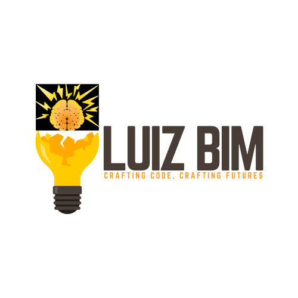

# Luiz Bim - Omni Hub

    

## 💻 Public Projects on this Repo

- ### [NX Project Setup Plugin]()

  A project that allow people to speed up the monorepo project setup by creating and adjusting automatically basic configurations that I personally used in my projects.

## 👤 Connect with me!

- [Linkedin](https://www.linkedin.com/in/luiz-bim/)
- [Website](https://luizbim.dev)
